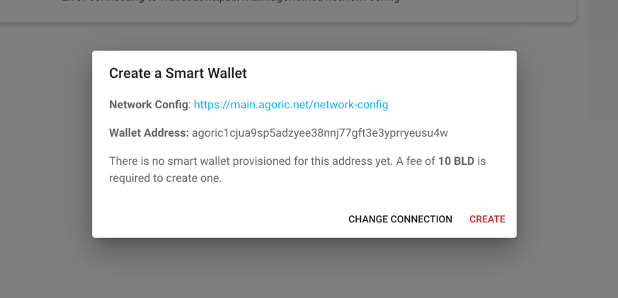

# Crabble UI
Crabble is a NFT lending/borrowing platform for NFTs with any sort of utility. This repository
contains the client side code for Crabble platform. 
## Setup && Run
### Install `agoric-sdk`
Although client code does not depend on most of the core sdk features of `agoric-sdk` it's better to stay consistent
with backend code(meaning smart-contracts) which is built on the `mainnet-1b` version of the sdk.
```shell
git clone https://github.com/Agoric/agoric-sdk.git
cd agoric-sdk
git checkout release-mainnet1B
yarn install
yarn build
yarn link-cli ~/bin/agoric
agoric --version
```

If `agoric --version` works, then execute below command.
````shell
cd agoric-sdk/packages/cosmic-swingset
make
````

Run `agd --help` to see if the `make` command succeeded.

### Create Test Accounts (One Time)
We need some test accounts (public and private keys with certain names) to mimic the user when we're developing
the client side. It's important that you make sure the account names are `gov1` and `gov2` as we'll depend on 
these accounts to exist in a future step.
````shell
agd keys add gov1 --keyring-backend=test
agd keys add gov2 --keyring-backend=test
````

Save the mnemonics to somewhere persistent.

### Start Agoric Blockchain
For our development environment we need to start a local Agoric blockchain. Run below script for that.
````shell
cd agoric-sdk/packages/inter-protocol
./scripts/start-local-chain.sh
````

Wait until yoe see `block 17 commit` in the log window that should pop up when you run `start-local-chain.sh`

### Install and Run Agoric Wallet
Agoric has its own wallet web app for packaging and sending transactions to Agoric blockchain. You should start
a local version of the wallet app before starting your dapp development. 

```shell
git clone -b crabble-ui https://github.com/anilhelvaci/wallet-app.git
cd wallet-app && yarn install
cd wallet && yarn start
```

Open `http://localhost:3000/wallet` in the browser **you've Keplr extension installed**. 

### Add `Agoric localhost` to Keplr
Follow the steps below;
* Open `http://localhost:3000/wallet` in the browser you've Keplr extension installed.
* Accept terms etc. and close any dialog that might open
* Go to `Settings` in the top right corner
* Choose `Localhost` from the dropdown in the opened dialog
* Click `Connect` 

    

Once you go thorough above steps a Keplr windows should open asking you to approve the `Agoric localhost` chain.
Approve the local Agoric blockchain. You might see the wallet app complaining about some stuff, for now don't let it
bother you. We'll get back to that later.

### Import `gov1` and `gov2` to Keplr
Follow the steps below;
* Open Keplr browser extension
* Click profile icon in the top right corner
* Click `Add Wallet`
* Choose `Import an existing wallet`
* Choose `Use recovery phrase or private key`
* Select `24 Words`
* Paste one of the mnemonics you saved from the earlier step and click `Import`
* Make sure `Agoric localhost` is selected in the visible chains

Remaining steps are not our concern, just complete the process.

### Provision the Smart Wallet
Remember me telling you the wallet app might complain some stuff. Well that 'some stuff' is actually the wallet app
telling you that you haven't provisioned(created) a `smart-wallet` yet. Don't worry the wallet app creates one for 
you if you want it to. To provision a smart-wallet you must have 10 BLDs in your account which we happen to have
because `start-local-chain.sh` sends some funds to `gov1` and `gov2` during the boot process. It also should provision
smart-wallets for gov1 and gov2, but I've encountered some problems in that step that's why I said the wallet app 
'might' complain about smart-wallet. Just click `Create` if you see the below dialog.



### Start Crabble UI
Finally, we can now run our actual project to start working on.
```shell
git clone https://github.com/CrabblePitch/crabble-ui.git
cd crabble-ui
yarn install
yarn dev
```