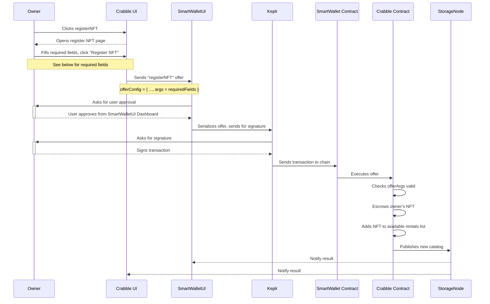
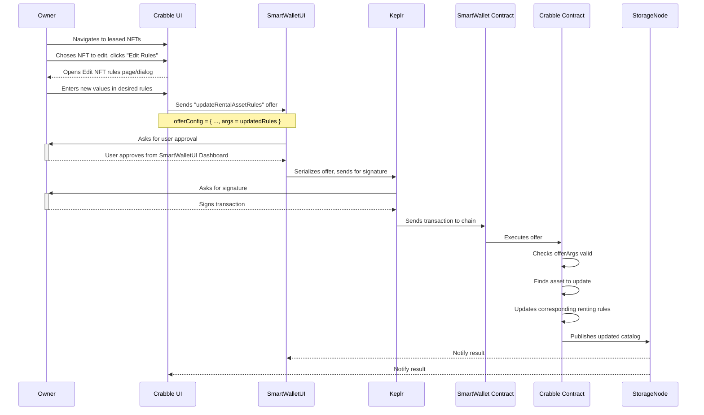
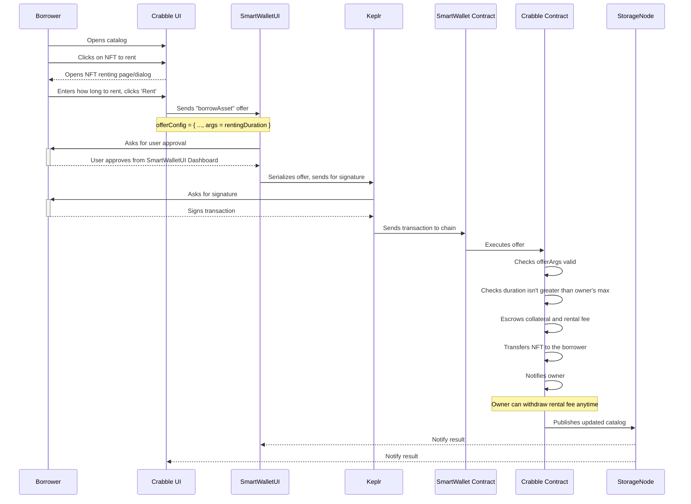
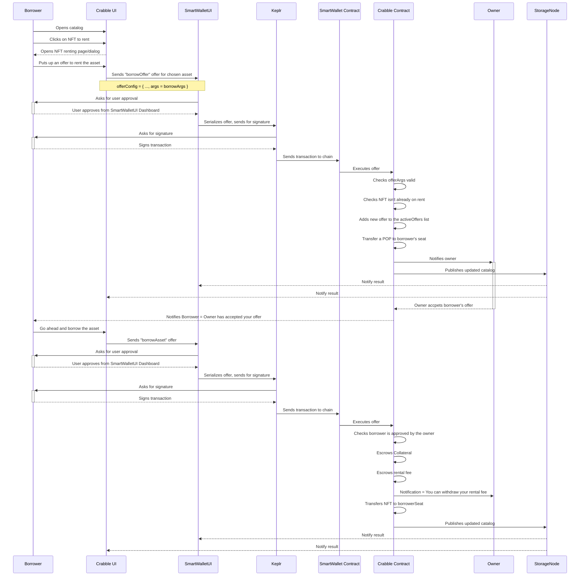
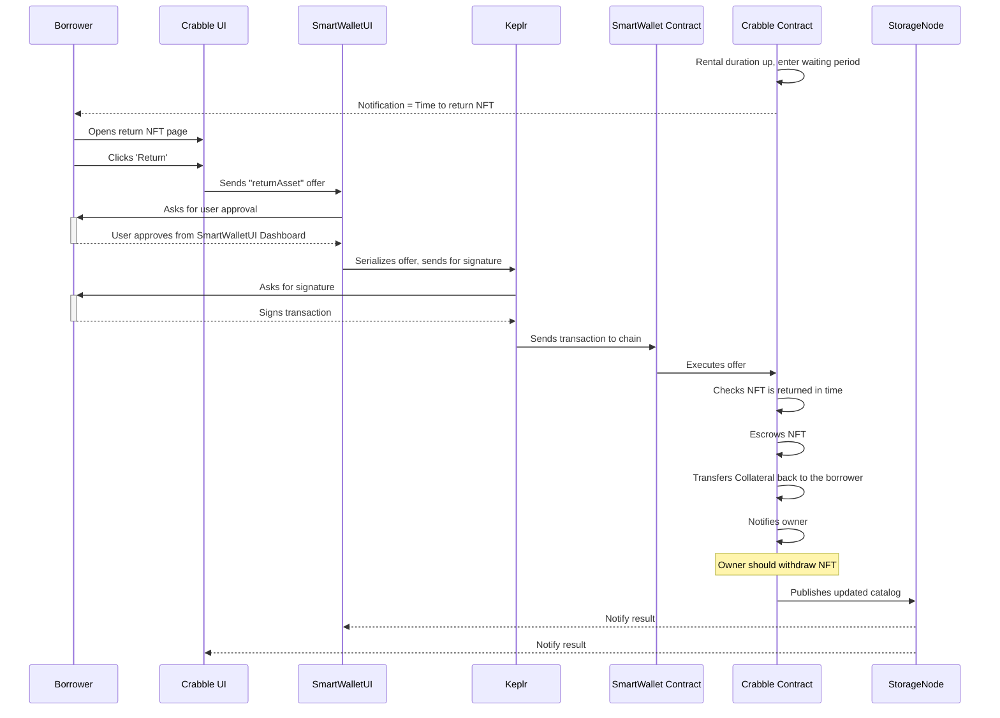
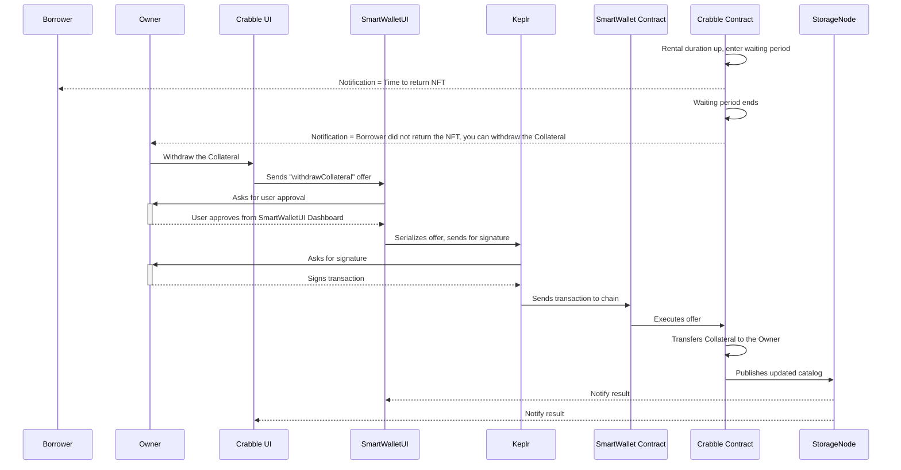
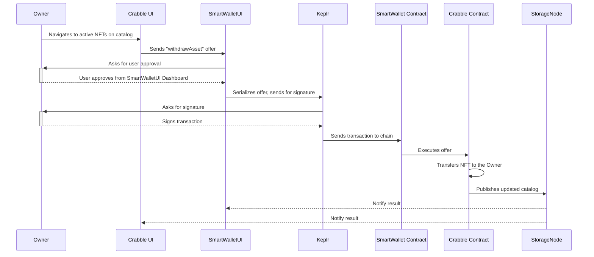
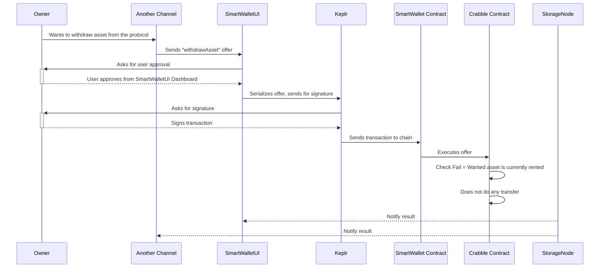

# Crabble Proof of Concept
This document should contain user stories we aim to support in `Crabble Proof of Concept`. The user stories listed here should include one or more sequence diagrams on below topics;
* User adds their NFT to be rented on the catalog
* User updates renting rules for their on-catalog NFT
* Borrower rents an NFT chosen from the catalog
  * AdHoc
  * Offer
* Borrower returns NFT on time
* Borrower does not return NFT
* Owner withdraws NFT from the protocol
* Owner tries to withdraw rented NFT

> **Important:** Below sequence diagrams do not contain all the uses cases we've implemented in the `CrabbleProtocol`
>. They only show the main functionalities. We should update this document according to the cases we've implemented
> in `CrabbleProtocol` unit tests.

> **Note**: For all the diagrams shown here, we assume that the user has provisioned their smartWallet.

## User add their NFT to be rented on the catalog

## User updates renting rules for their on-catalog NFT

> **Note**: There are three possible borrowing methods listed below, we should make an internal meeting and decide on which one is better, which one to support etc.

## Borrower rents an NFT chosen from the catalog - AdHoc

## Borrower rents an NFT chosen from the catalog - Offer

## Borrower returns NFT on time

## Borrower does not return NFT

## Owner withdraws NFT from the protocol

## Owner tries withdraw a rented NFT

> **Note**: Our `Crabble UI` should not let the user perform such an action, but I'm going to put this use case here just in case. Should the user tries to interact with the protocol over another channel instead of Crabble UI.
